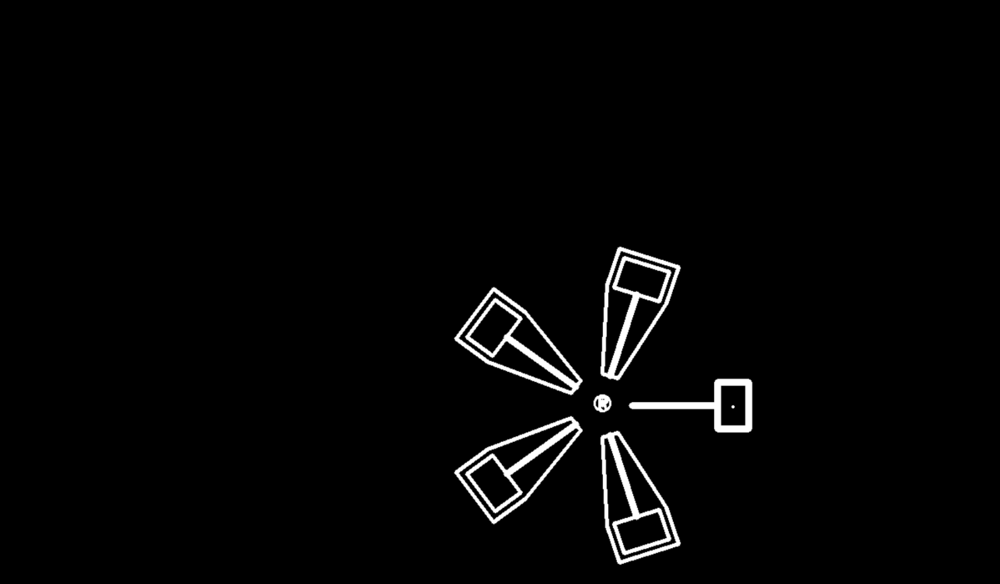

# 第三次任务

这次任务的要求的绘图结果如下：
(R上的小圈我忘记删除了)

## 具体思路

### 图像识别

- 查找所有轮廓
- 通过第一次对轮廓面积的计算，发现R是面积最小的，锤子次之，所以取两次按照轮廓面积最小值得到R、锤子
- 通过查找两者的最小外接圆确定中心，其中锤子需要经过一次掩模操作提取出内轮廓（矩形）
- 我一开始按照最早那位学长的readme要求在R与锤子之间绘制了圆形，这使得我之后都是按照这个圆的圆心center进行的拟合

### 参数拟合

#### ceres安装

因为我的笔记本装的是ubuntu24.04，所以ceres1.14版本太老了装不上，没办法我借用了谢万皓的电脑（他装好ceres后就没有再做下午，退出rm了）
当然发现我的笔记本装不了ceres1.14之前，我也在费劲的安装，由此也发现了一些问题：

- 2022年之后的ceres solver(github)上缺少了tbb_stddef.hpp头文件(我不知道是不是我系统的问题，总之我不单独下载安装这个文件的话我无法正常进行cmake操作)
- 如果采用默认安装了那些eigens依赖，在make操作的时候会有报错，具体内容为系统找不到SuiteSparese文件的位置，我打开residual_block_test.cc文件，发现里面似乎是必须要SuiteSparese4.0才行？但接下来我没有继续尝试。

#### 解决思路

- 首先是原函数 $$ v=A\sin{(\omega t + \alpha)}+b $$ 无法直接对其分析，将其积分得 $$ \theta=bt+A/\omega (cos(\phi +\pi /2)-cos(\omega t+\phi +\pi /2)) $$ 为了之后在程序中计算方便，两边同时取$sin$，得到残差函数
- 其次是取最开始时刻R中心和center的坐标，并转化成center想对于R中心的坐标，经过t时刻后同样按此处理，通过两个相对坐标求出$sin(\theta)$
- 确定每个参数的范围，并且规定迭代超过100次后认为无效，只记录此次运行时间但重置次数
- 最后的运行结果最优为1.56s,最差为2.8s